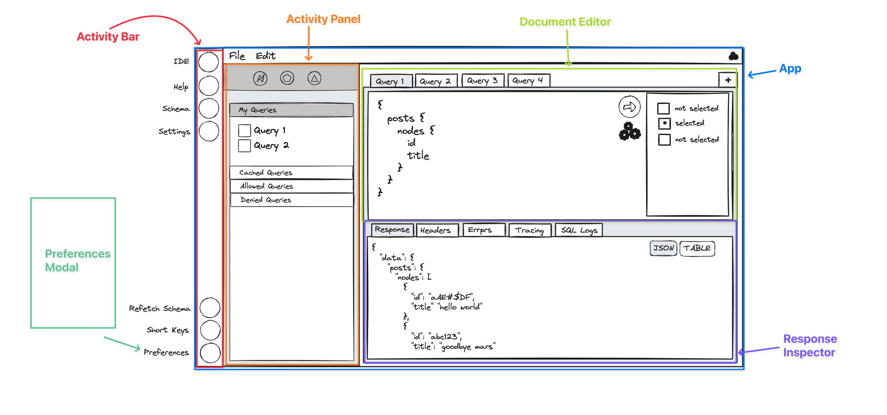

# WPGraphQL IDE

## Overview

The WPGraphQL IDE is a web-based IDE for interacting with a WPGraphQL server. It is built using React and is designed to be a modern, fast and extensible IDE for working with WPGraphQL.

The WPGraphQL IDE is broken up into several packages, each of which is responsible for a different part of the IDE.

Each package will have its own redux store using the `@wordpress/data` package where it's responsible for defining the state and actions for that part of the IDE.

By using `@wordpress/data` we can ensure that the state is managed in a predictable way and that the state is immutable.

Additionally, this allows for the state to be easily shared between different parts of the IDE and for the state to be easily serialized and de-serialized.

For example, 3rd party plugins can easily interact with the state of the IDE by dispatching actions to the store or by subscribing to changes in the state.

This allows for the common functionality be handled centrally and in a consistend way, but re-used as needed.

For example, the application will handle the fetching of and validation of the Schema, but any component that is added to the application can easily access the schema state and use it to validate queries, etc.

## Packages

Each package has its own README.md file with more information about the package.

### App

The App package is the main entry point for the WPGraphQL IDE. It is responsible for rendering the main layout of the IDE and managing general state of the application.

### Components

The Components package contains the various re-usable components that are focused on presentation and re-usability. These components are used within the other packages to build the WPGraphQL IDE.

Similar to the `@wordpress/components` package, the `@wpgraphql-ide/components` package is designed to be a collection of re-usable components that can be used to build the WPGraphQL IDE.

These components should be focused on presentation and re-usability and should not contain any business logic or state management, unless very directly tied to the presentation state of the component.

### Activity Bar

The Activity Bar is the left-hand side of the IDE that contains the main navigation and utility links.

Similar to how Gutenberg blocks can be registered and added to the block inserter, the Activity Bar is designed to be extensible and allow for 3rd party plugins to add their own links to the Activity Bar.

The Activity Bar is used to navigate between the various parts of the IDE, such as the Document Editor, Schema Inspector Tools (future), Extensions, WPGraphQL Setttings, IDE Preferences, etc.

### Activity Panel

The Activity Panel is the area that is displayed to the right of the Activity Bar but to the left of the primary content area.

The activity panel is used to display the various panels that are used to interact with the IDE or other parts of the application, for example installing extension plugins.

### Document Editor

The Document Editor package is responsible for rendering the main content area of the IDE. It is used to display the various GraphQL Documents that are open in the IDE in a tabbed interface and allows for the documents to be created, updated, deleted and executed.

### Preferences

The Preferences package is responsible for managing the preferences of the WPGraphQL IDE. It is used to display the preferences panel and to manage the preferences of the IDE, such as the theme (light/dark, etc), font size, etc.

### Response Inpsector

The Response Inspector package is responsible for displaying the response from the server when a GraphQL operation is executed. It is used to display the response in a tabbed interface and allows for various parts of response (body, headers, debug info, etc) to be inspected and navigated.
